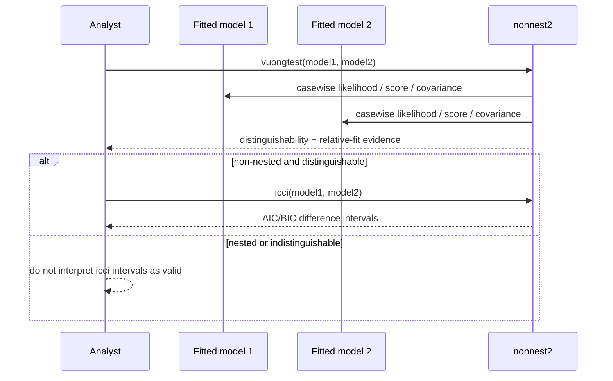

# nonnest2 product and technical gap baseline

**Snapshot:** 2026-09-02  
**Default-branch evidence:** `master@807e9405f8c32faafdf186f977a24d0b23358b43`  
**Audience:** maintainers, scientific reviewers, integration reviewers, and licensing/provenance reviewers

This document records current product responsibility, scientific contracts, provenance constraints, and buyer-visible gaps. It is a dated evidence ledger, not a substitute for re-reading live GitHub PR/check/release state before integration.

## Product responsibility

`nonnest2` is an R statistical library for comparison of fitted nested and non-nested models using Vuong-based distinguishability and relative-fit procedures, plus confidence intervals for differences in AIC and BIC.

The repository owns the comparison procedures and adapter contracts exposed by `vuongtest()`, `icci()`, and `llcont()`. It does not own the fitted-model implementations supplied by `lavaan`, `mirt`, `OpenMx`, base R model classes, or other supported model ecosystems, and it does not turn statistical comparison into causal or substantive model validity.

## Ubiquitous language and invariants

- **Casewise log-likelihood contribution:** one numeric contribution per observation, returned by `llcont()` or a caller-supplied `ll1` / `ll2` function.
- **Score contribution:** casewise parameter-score information supplied separately through `score1` / `score2` or the supported class-specific/default score path.
- **Parameter covariance:** covariance evidence supplied through `vc1` / `vc2` and used separately from the likelihood-contribution contract.
- **Distinguishability:** whether the competing models can be statistically distinguished on the observed data under the Vuong procedure.
- **Relative fit:** direction/evidence of model-fit difference after the relevant distinguishability/nesting conditions are respected.
- **Observation alignment invariant:** compared casewise vectors must refer to the same dependent variable(s), same observations, and identical observation row order. Current source documentation explicitly states that the package does not verify this alignment.
- **ICCI applicability invariant:** `icci()` is intended for non-nested models that are distinguishable under the `vuongtest()` variance/distinguishability test; nested or indistinguishable inputs can yield intervals that are invalid for the intended interpretation.

## Context Map

```text
fitted-model packages / user models
        |
        | llcont + score + covariance adapters
        v
+-------------------------------+
| nonnest2 model comparison     |
| - distinguishability          |
| - relative fit                |
| - AIC/BIC difference intervals|
+-------------------------------+
        |
        v
analysis/reporting code owned by the caller
```

External model packages remain separate authorities for their estimands, fitting behavior, parameterization, likelihoods, scores, and covariance estimators. `nonnest2` consumes those quantities through adapter boundaries; it does not copy their domain/runtime authority.

## Product flow UML



## Data / ERD boundary

The current package has no repository-owned database or persistent domain schema. A database ERD would therefore invent authority that does not exist and is intentionally **not applicable** to this baseline. Fitted model objects and analysis data remain caller/model-package state.

## Current implementation evidence

Default-branch `DESCRIPTION` at `807e9405f8c32faafdf186f977a24d0b23358b43` declares package version `0.5-9`, R `>= 3.0.0`, imports `CompQuadForm`, `mvtnorm`, `lavaan`, `sandwich`, and `methods`, and declares source license `GPL-2 | GPL-3`. It also identifies Edgar Merkle and Dongjun You as authors plus additional contributors and points to the upstream `qpsy/nonnest2` repository.

`R/vuongtest.R` and `R/icci.R` document the same dependent-variable / modeled-variable / observation-order requirement and explicitly state that current code does not check it. `R/icci.R` also states that nested or variance-test-indistinguishable models make its returned intervals incorrect for the intended interpretation.

The ContextualWisdomLab GitHub repository currently exposes no GitHub Release. Package/source metadata must therefore not be presented as an immutable organization release artifact.

## Gap register

| Priority | Gap | Evidence / risk | Required action | Status |
| --- | --- | --- | --- | --- |
| P0 | Commercial source-license incompatibility with organization default | `DESCRIPTION` declares `GPL-2 | GPL-3`; inherited authors/contributors mean maintenance does not prove unilateral relicensing authority | Establish rights-backed permissive relicensing, independently authored compatible replacement with scientific regression evidence, or an explicitly approved repository-specific GPL distribution model | **Blocked / unresolved** |
| P0 | Observation alignment is not executable | Source docs say models must use the same dependent/modeled variables and identical observation order, but current code does not validate that invariant | Add a fail-closed comparison/adaptor contract that proves compatible casewise population/order where technically observable; otherwise require an explicit caller-supplied immutable alignment identity and test mismatch cases | **Open scientific-integrity gap** |
| P1 | Adapter conformance is implicit across multiple quantities | Likelihood contributions, score contributions, and covariance matrices are separate interfaces and can silently disagree in row/parameter semantics | Add executable adapter conformance fixtures for supported classes, including length/order, finite-value, parameter-dimension, missing-data and mismatch failure cases | **Open evidence gap** |
| P1 | No immutable ContextualWisdomLab release | GitHub release inventory is empty; `DESCRIPTION` version is source metadata only | After licensing and scientific gates are resolved, publish one protected-source package/release with reproducible checks, source provenance, checksum/SBOM/license evidence as applicable | **Not release-ready** |
| P1 | Open PR queue contains overlapping security/performance variants | Multiple current PRs target the same exported-input-validation and `llcont.glm` optimization surfaces | Reconcile by verified source-delta carryover into one canonical writer per concern; retire predecessors only after every valid test/fix/documentation delta is proven present | **Active reconciliation required** |
| P2 | Product documentation was legacy/terse | Canonical README PR #118 now owns product-first usage, statistical conditions, provenance, Pages-safe navigation, and this gap ledger | Keep README claims synchronized with protected source and exact release state; do not promote branch evidence to released truth | **In progress on #118** |

## Current README / documentation integration lane

PR #118 is the canonical public-surface writer for `README.md`, `docs/index.md`, `docs/commercial-license-boundary.md`, and this gap baseline. Badge-only PR #115 was closed only after its complete two-line Ask DeepWiki delta was verified present in #118.

At snapshot time, #118 exact current head is `c76d8b91f56f74e238da82257066596b420a92c2` before this baseline commit; every source mutation after that head invalidates those predecessor checks. Live checks/reviews must always be re-read from the final unchanged head.

## Licensing / provenance action boundary

See [`commercial-license-boundary.md`](commercial-license-boundary.md). The organization must not add a root Apache-2.0/MIT file or rewrite `DESCRIPTION` merely because the repository is hosted under ContextualWisdomLab. Dependency licenses also do not change the inherited package source license.

Any independent replacement must preserve the public statistical behavior without copying GPL implementation expression. Scientific acceptance should include reference/black-box parity for distinguishability, relative fit, AIC/BIC interval behavior, supported adapter classes, missingness/alignment edge cases, and numerical tolerances.

## Verification and update rule

Update this ledger when a protected-source statistical contract changes, a licensing/provenance fact changes, an immutable release appears, or a gap changes state. PR heads/check run IDs are snapshot evidence only; merge authority always comes from a fresh read of the unchanged candidate head, current base, reviews/threads, checks, and repository governance.
